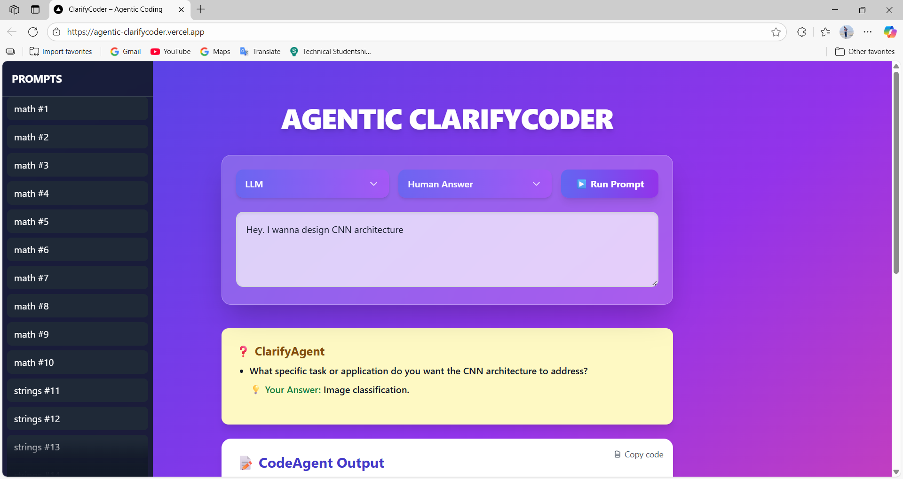
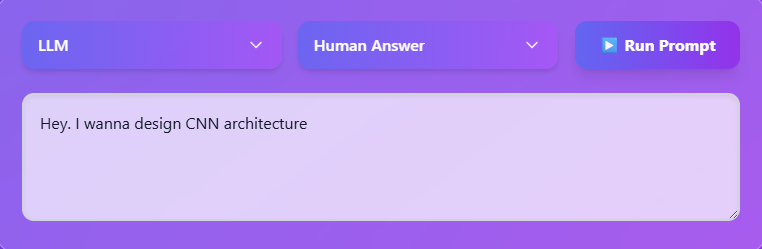
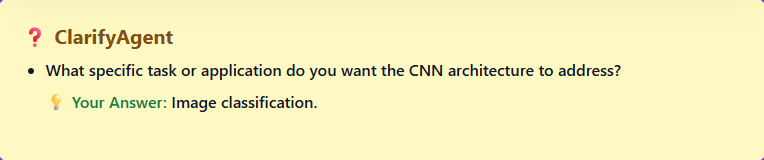
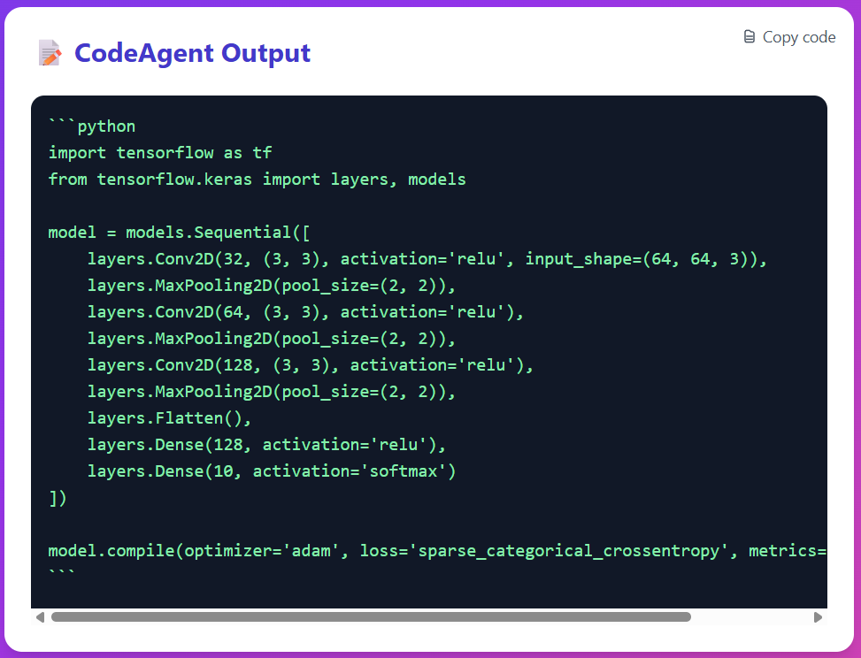

# ⚡ Agentic ClarifyCoder – Frontend

<p align="center">
  
</p>

> **ClarifyCoder Frontend** is a **Next.js + Tailwind + Framer Motion UI** for interacting with the multi-agent ClarifyCoder backend.  
> It delivers a polished, responsive, and animated interface with **glassmorphism, gradients, and smooth transitions**, making the research system usable like a real product.

---

## ✨ Features

- 🎨 **Premium UI** with gradients, blur, and animations
- 📱 **Responsive layout** (desktop + mobile with sidebar, menus)
- 🔽 **Custom Dropdowns** for selecting Baseline vs LLM, Auto vs Human Answer
- 📂 **Sidebar Prompt Library** (loads tasks from `prompts.jsonl`)
- 📝 **Interactive Pipeline**: shows ClarifyAgent → AnswerAgent → CodeAgent → EvalAgent → RefineAgent results
- 📋 **GitHub-style Copy Button** for code blocks
- ⚡ **Run Prompt Button** with loading states & enter-to-run shortcut
- 👤 **Human-in-the-Loop Inputs** when answer mode = “Human Answer”
- 🖼️ **Screenshots + Demo Visualization**

---

## 🖥️ Demo Screenshots

### 🔹 Prompt Entry
> Enter prompt manually or you can select from baseline prompts.
<p align="center">
  
</p>

### 🔹 ClarifyAgent in Action
> Automatically asks clarifying questions when the prompt is ambiguous.
<p align="center">
  
</p>

### 🔹 CodeAgent Output
> Candidate code displayed with syntax highlighting + copy button.
<p align="center">
  
</p>

### 🔹 EvalAgent + RefineAgent
> Shows pass/fail status and refinements with re-evaluation.
<p align="center">
  
</p>

---

## 📂 Project Structure
clarifycoder-frontend/

├─ app/ # Next.js app directory

├─ components/ # UI components (Dropdown, Sidebar, CopyButton, etc.)

├─ public/ # Static assets (icons, screenshots)

├─ styles/ # Tailwind setup + global styles

├─ package.json # Dependencies

├─ tailwind.config.js # Tailwind config

└─ tsconfig.json # TypeScript config


---

## ⚙️ Tech Stack

- **Framework**: Next.js 14 + TypeScript
- **Styling**: TailwindCSS, custom glassmorphism gradients
- **Animations**: Framer Motion
- **UI Components**: HeadlessUI, Lucide Icons
- **State Management**: React Hooks
- **API Integration**: Fetch to backend (`/run_prompt`)

---

## 🚀 Getting Started

### 1. Clone the repo
```bash
git clone https://github.com/hsb-amjad/clarifycoder-frontend.git
cd clarifycoder-frontend
```

### 2. Install dependencies
```bash
npm install
# or
yarn install
```
``` bash
npm install -D tailwindcss@3 postcss autoprefixer
```
``` bash
npx tailwindcss init -p
```

### 3. Run Dev Server
```bash
npn run dev
```

- Frontend runs at: http://localhost:3000
- ⚠️ Note: Backend must also be running. See [clarifycoder-backend]().

## 🌐 Deployment
This frontend is optimized for Vercel:
1. Push repo to GitHub.
2. Link with Vercel dashboard.
3. Configure backend API endpoint in environment variables if needed.
4. Deploy → live in seconds 🚀

## 👤 Author

**Haseeb Amjad** – Mechatronics Engineer | Machine Learning | AI + Robotics | MedTech  
🌐 [Portfolio]([https://haseebamjad.dev](https://my-portfolio-sage-zeta-79.vercel.app))
💼 [LinkedIn](www.linkedin.com/in/hsb-amjad)
