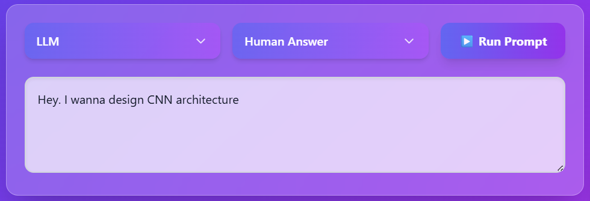
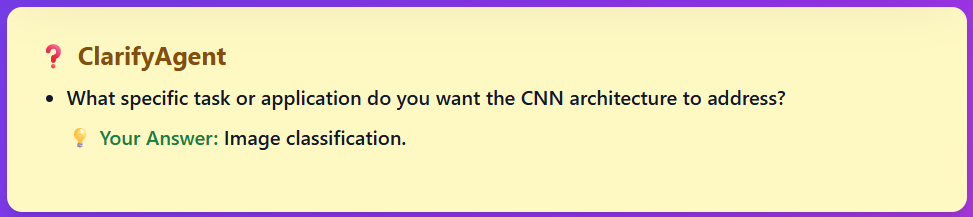

# ⚡ Agentic ClarifyCoder – Frontend

<p align="center">
  
</p>

> **ClarifyCoder Frontend** is a **Next.js + Tailwind + Framer Motion UI** for interacting with the multi-agent ClarifyCoder backend.  
> It delivers a polished, responsive, and animated interface with **glassmorphism, gradients, and smooth transitions**, making the research system usable like a real product.

---

## ✨ Features

- 🎨 **Premium UI** with gradients, blur, and animations
- 📱 **Responsive layout** (desktop + mobile with sidebar, menus)
- 🔽 **Custom Dropdowns** for selecting Baseline vs LLM, Auto vs Human Answer
- 📂 **Sidebar Prompt Library** (loads tasks from `prompts.jsonl`)
- 📝 **Interactive Pipeline**: shows ClarifyAgent → AnswerAgent → CodeAgent → EvalAgent → RefineAgent results
- 📋 **GitHub-style Copy Button** for code blocks
- ⚡ **Run Prompt Button** with loading states & enter-to-run shortcut
- 👤 **Human-in-the-Loop Inputs** when answer mode = “Human Answer”
- 🖼️ **Screenshots + Demo Visualization**

---

## 🖥️ Demo Screenshots

### 🔹 Prompt Entry
> Enter prompt manually or you can select from baseline prompts.
<p align="center">
  
</p>

### 🔹 ClarifyAgent in Action
> Automatically asks clarifying questions when the prompt is ambiguous.
<p align="center">
  
</p>

### 🔹 CodeAgent Output
> Candidate code displayed with syntax highlighting + copy button.
<p align="center">
  
</p>

### 🔹 EvalAgent + RefineAgent
> Shows pass/fail status and refinements with re-evaluation.
<p align="center">
  
</p>

---

## 📂 Project Structure

```plaintext
clarifycoder-frontend/
 ├─ .next/                # Next.js build output
 ├─ .vercel/              # Vercel deployment configs
 ├─ app/                  # Main app directory
 │   ├─ favicon.ico
 │   ├─ globals.css       # Global styles
 │   ├─ page.module.css   # Module-specific styles
 │   └─ page.tsx          # Root page
 ├─ node_modules/         # Installed dependencies
 ├─ public/               # Static assets (screenshots, icons)
 │   └─ screenshots/      # Images for README (e.g., mainpage.png)
 ├─ .gitignore
 ├─ eslint.config.mjs
 ├─ next-env.d.ts
 ├─ next.config.ts
 ├─ package-lock.json
 ├─ package.json
 ├─ postcss.config.js
 ├─ README.md
 ├─ tailwind.config.js
 └─ tsconfig.json
```

---

## ⚙️ Tech Stack

- **Framework**: Next.js 14 + TypeScript
- **Styling**: TailwindCSS, custom glassmorphism gradients
- **Animations**: Framer Motion
- **UI Components**: HeadlessUI, Lucide Icons
- **State Management**: React Hooks
- **API Integration**: Fetch to backend (`/run_prompt`)

---

## 🚀 Getting Started

### 1. Clone the repo
```bash
git clone https://github.com/hsb-amjad/clarifycoder-frontend.git
cd clarifycoder-frontend
```

### 2. Install dependencies
```bash
npm install
# or
yarn install
```
``` bash
npm install -D tailwindcss@3 postcss autoprefixer
```
``` bash
npx tailwindcss init -p
```

### 3. Run Dev Server
```bash
npm run dev
```

- Frontend runs at: http://localhost:3000
- ⚠️ Note: Backend must also be running. See [clarifycoder-backend](https://github.com/hsb-amjad/clarifycoder-backend.git).

---

## 🌐 Deployment

This frontend is optimized for Vercel:
1. Push repo to GitHub.
2. Link with Vercel dashboard.
3. Configure backend API endpoint in environment variables if needed.
4. Deploy → live in seconds 🚀

---

## 📚 Citation

If you use **ClarifyCoder-Agent (Frontend)** in academic work:
```bibtex
@misc{clarifycoder-frontend2025,
  title        = {ClarifyCoder-Agent Frontend},
  author       = {Amjad, Haseeb},
  year         = {2025},
  howpublished = {GitHub},
  url          = {https://github.com/hsb-amjad/clarifycoder-frontend},
  note         = {Frontend repository for ClarifyCoder-Agent project}
}
```

## ⭐ Support

If you like this project, star ⭐ the repo and share feedback.
PRs and issues welcome!

## 👤 Author

**Haseeb Amjad** – Mechatronics Engineer | Machine Learning | AI + Robotics | MedTech  
🌐 [Portfolio](https://my-portfolio-sage-zeta-79.vercel.app)
💼 [LinkedIn](https://www.linkedin.com/in/hsb-amjad)
